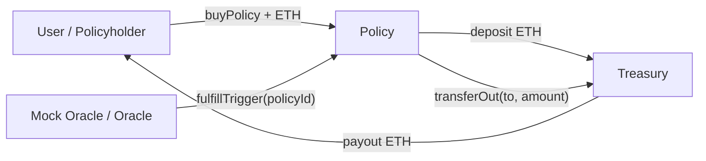

# ParametricInsurance — Architecture, Flows, and Developer Guide

## What this is
A modular parametric insurance system built with Hardhat (TypeScript) and OpenZeppelin:
- Treasury: secure ETH vault for premiums and payouts
- Policy: policy lifecycle, premium intake, oracle-triggered payouts, pause control
- MockOracle: development-only helper that simulates an oracle callback

## Key features
- Solidity 0.8.20 with optimizer enabled
- OpenZeppelin Ownable, ReentrancyGuard, Pausable
- Separation of concerns: funds live in `Treasury`; logic lives in `Policy`
- Oracle integration point (replace `MockOracle` with Chainlink in production)
- Tests for end-to-end buy → trigger → payout

## High-level architecture


### Contract responsibilities
- Treasury
  - Holds ETH from premiums and top-ups
  - Emits Deposit/Withdraw events
  - `transferOut(to, amount)` callable by owner or authorized `Policy`
  - `emergencyWithdraw()` for recovery by owner
- Policy
  - Accepts premiums via `buyPolicy(payout, threshold)` (forwarded to Treasury)
  - Stores policies, supports `pause`/`unpause`
  - `triggerPolicy(policyId)` callable by owner or authorized `oracle`
  - Executes payouts once-per-policy via Treasury with reentrancy protection
- MockOracle
  - Calls `Policy.triggerPolicy(policyId)` to simulate external oracle fulfillment

## Typical flows
1) Purchase
- User calls `Policy.buyPolicy(payout, threshold)` with `msg.value` premium
- Policy records policy and forwards ETH to `Treasury.deposit{value: msg.value}()`

2) Trigger and payout
- Oracle (or owner) calls `Policy.triggerPolicy(policyId)`
- Policy validates conditions and calls `Treasury.transferOut(policyholder, payout)`
- Double-spend is prevented via `payoutExecuted[policyId]`

## Setup
```bash
npm install
npx hardhat compile
```

Environment (.env at project root) when deploying to a public testnet:
```
PRIVATE_KEY=0xYour64HexPrivateKey
RPC_URL=https://sepolia.infura.io/v3/YourProjectId
ETHERSCAN_API_KEY=YourApiKey  # optional
```

## Local development
- Run all tests
```bash
npx hardhat test
```

- Deploy locally (in-memory Hardhat network)
```bash
npx hardhat run scripts/localDeploy.ts
```
This deploys `Treasury` and `Policy`, authorizes the policy in the treasury, and logs addresses.

- Full deploy including MockOracle and initial treasury funding
```bash
npx hardhat run scripts/deploy.ts
```
This deploys `Treasury`, `Policy`, `MockOracle`, sets `policy` and `oracle`, and funds the `Treasury` with 1 ETH from the deployer.

## Using the MockOracle
In tests and local flows, `MockOracle.fulfillTrigger(policyId)` simulates the real oracle calling back into `Policy.triggerPolicy(policyId)`. In production, replace `MockOracle` with a Chainlink oracle/consumer that invokes the same policy function when the external condition is met.

## ABI export for frontends
ABIs are exported to `artifacts/abi/*.abi.json` for easy frontend consumption.

- Export script (TypeScript): `scripts/exportAbi.ts`
- Run after compile:
```bash
npx hardhat compile
npx ts-node scripts/exportAbi.ts
```
If your environment requires CommonJS:
```bash
npx ts-node --compiler-options "{\"module\":\"commonjs\"}" scripts/exportAbi.ts
```
Generated files:
- `artifacts/abi/Policy.abi.json`
- `artifacts/abi/Treasury.abi.json`
- `artifacts/abi/MockOracle.abi.json`

## Security notes
- Keep `owner` keys secure; `Treasury.emergencyWithdraw` and `setPolicy` are owner-gated
- `Policy` uses `Pausable` for incident response; `whenNotPaused` guards policy purchases
- Reentrancy protected payout path and single-execution guard (`payoutExecuted`)

## Next steps
- Replace `MockOracle` with a real oracle (e.g., Chainlink Functions/Any-API)
- Add off-chain monitoring and alerting around triggers and payouts
- Extend policies with pricing/underwriting logic and lifecycle management
